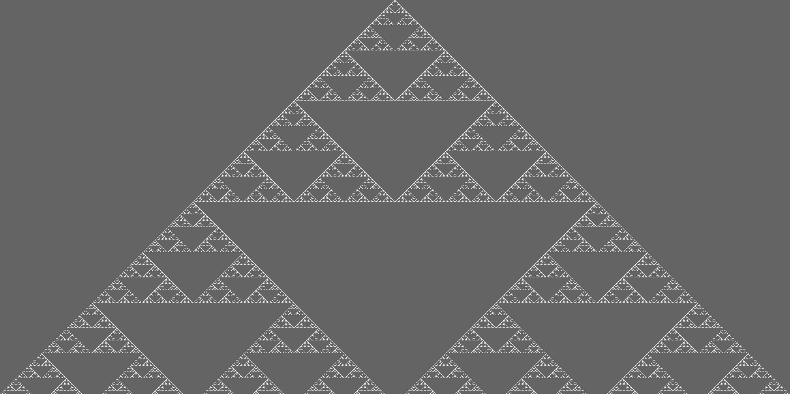
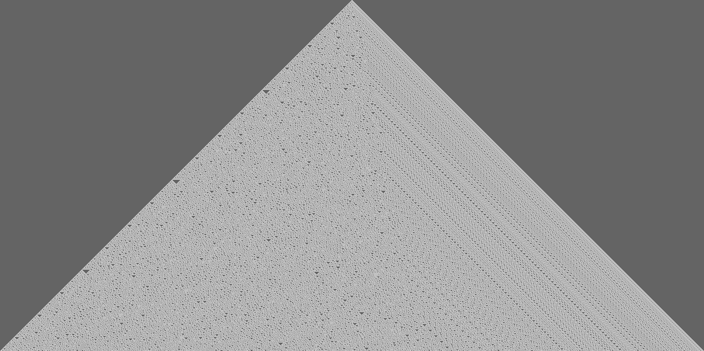
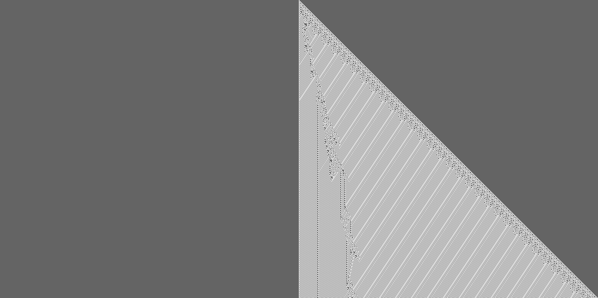

Python で簡単 cellular automaton
---------------------------------

ごめんなさい，一次元です．

書いた

```python
#!/usr/bin/python

class CellularAutomaton(object):
    
    def __init__(self, elements, rulecode):
        self.cells = list(elements)
        self.rule = CARule(rulecode)
        self.length = len(elements)
    
    def __str__(self):
        return ''.join(map(lambda x: '#' if x else '.', self.cells))
    
    def next(self):
        nextgen = [self.rule(self.cells[i:i+3]) for i in xrange(self.length-2)]
        self.cells = [self.cells[0]] + nextgen + [self.cells[-1]]
    

class CARule(object):
    
    def __init__(self, wfcode):
        '''
        wolfram code: given as an integer with base 10, not binary.
        '''
        self.rulenum = wfcode
        self.rule = map(lambda n: bool(int(n)), "{0:08b}".format(wfcode))
        self.rule.reverse()
        # self.rule :: [Bool]
    
    def __call__(self, conditions):
        ''' conditions : [Bool, Bool, Bool] '''
        return self.rule[
            sum([int(a) * 2**i for (i,a) in enumerate(conditions)])]
    
    def __str__(self):
        return "Wolfram Code {0}".format(self.rulenum)


def main():
    import os
    import random
    width = int(os.popen('stty size', 'r').read().split()[1])
    halflength = (width-1)//2
    firstgen = [0]*halflength+[1]+[0]*halflength
    # firstgen = [random.choice((True, False)) for i in xrange(width)] for random initializing.
    mycell = CellularAutomaton(firstgen, 90)
    for i in range(300):
        print mycell
        mycell.next()

if __name__ == '__main__':
    main()

```

解説しようかと思ったけどまあ面倒．もっとコメント書かないとなぁ……．
Class を 2つも使ってるのはどうなの説もあります．どのくらいのをどうするのが良いかわからなくて，つい class にしてしまう．
多分そのほうが脳内で組み立て易いんだろうなぁ．うーん．

`main` 関数を次のように書き換えると簡単に画像への出力に出来ます． PIL 便利（便利さを初めて知った）．

```python
import Image
import numpy as np

def main():
    width = 2001
    gens = 1000
    myca = np.zeros(width*gens, dtype=int).reshape(gens, width)
    halflength = (width-1)/2
    firstgen = [0]*halflength+[1]+[0]*halflength
    mycell = CellularAutomaton(firstgen, 110)
    for i in range(gens):
        myca[i,:] = map(lambda x: 255 if x else 100, mycell.cells)
        mycell.next()
    
    img = Image.fromarray(np.uint8(myca))
    img.save("./rule110_2001_1000.png")

```

ちょっとこっちの方は hard coded でアレですが．


で，結果

(terminal で出力)


(画像)
Wolfram code で

rule 90

rule 30

rule 110



