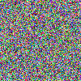

PIL + numpy で色を扱う
----------------------

この企画を始めたのはちょうど先月の 20 日ということなので，この更新に伴って
丸ひと月企画が続いたということになります．時期を変えれば情報系 advent calendar みたいな感じですね．
ということで，「記事に要求する品質 / 内容の量を適切に，ある程度余裕をもって低く設定しておけば，
ひとり advent calendar も不可能ではない」ことが実証できた，ような気が多少しています．それでは本日の記事．

これまで何回か([cellular automaton](./1.python-ca.md), [Perlin noise](./9.python-perlinnoise.md) ほか)，
Python imaging library と numpy を使ってお気軽にデータの画像化（グラフ化ではなく）をしてきました．

ここまでで扱ってきたのは greyscale のものでしたが，ここで色を扱うのはどのようにするか，というのを考えます．
greyscale では二次元データの形でそのまま値を保存してきました：

```python
import numpy as np
import Image
img_data = np.array([0,0,0,255,255,255,100,100,100], dtype=np.uint8).reshape((3,3))
img = Image.fromarray(img_data)
img.show()
```

これで 3*3 pixels の画像ができるわけですねー．

では RGB ではどうか，という話はご想像の通り，ここで `0` とか `int` (`np.uint8`) が入ってるところに
length 3 の `np.array` が入ります．

イメージは

```python
[[[166 164 121]
  [245  59  72]
  [136  47 166]
  ..., 
  [195 252  90]
  [197  26 161]
  [ 69 236 154]]
  ....
  ]]
```

こういう感じ． `[166 164 121]` で 1 pixel, っちゅうわけです．

では早速，ランダムなノイズ（とにかくランダムな）でも作ってみましょうか．

[`pil_colour.py`](../../Scripts/19Nov2013.pil-colour.py)

```python
#!/usr/bin/python

import numpy as np
import Image
import random

imagewidth = 100

imgsrc = [random.randint(0,255) for i in xrange(3 * imagewidth**2)]
img_data = np.array(imgsrc, dtype=np.uint8).reshape((imagewidth,imagewidth,3))

img = Image.fromarray(img_data)
img.save('./random.png')
```

ほんで結果



これでまたお手軽にできることが増えました．ぱちぱち．


ところで，こういう画像をズームしていってもピクセルがギザギザ見えるようにならないのはそういうもんでいいんだろうか．


今回の記事は [NumPyのarrayとPILの変換 - white wheelsのメモ](http://d.hatena.ne.jp/white_wheels/20100322/p1) を参考にしました．thx!
